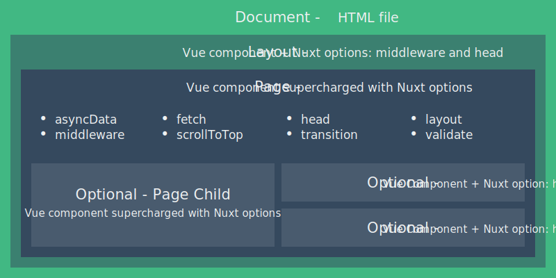

1. # Vuex

   ## 组件间通信方式

   ### 状态管理

   - state, 驱动应用的数据源
   - view, 以声明的方式将state映射到视图
   - actions, 响应在view上的用户输入导致的状态变化

   ### 常见通信方式

   - 父组件通过props传值到子组件
   - 子组件通过emit event传递到父组件
   - 不相关组件传值, 通过event bus来传递
     - 直接`export new Vue()`作为事件bus
     - 组件间通过`bus.$emit, bus.$on`来监听和处理事件
   - 通过`$refs, $root, $parent, $children`来获取组件的引用, 然后直接改变状态
     - 普通dom应用ref获取dom
     - 组件应用ref获取组件实例
     - 不推荐使用, 容易导致状态管理混乱

   ### 多组件共享状态

   - 将需要共享的状态保存在全局唯一的对象中集中维护, 并在需要的组件中导入
   - 约定对对象的修改必须调用对象导出的属性, 不允许直接修改

   ## Vuex概念

   - 专门为vue设计的状态管理库
   - 采用集中式存储共享状态的方式
   - 作用是进行状态管理, 解决复杂的组件间通信, 数据共享
   - 集成到devtools中, 提供time-travel, history-rollback等功能

   ### 什么时候使用

   - 非必要不使用
   - 大型的单页应用程序
     - 多个视图依赖于同一状态
     - 不同视图行为需要变更同一状态

   ### Store

   全局唯一存储状态的对象, 通过点访问状态, 通过commit提交修改来改变state

   ### State

   ```js
   // 可以使用mapState将Store属性映射到computed中
   import { mapState } from 'vuex'
   export default {
     computed: {
       ...mapState(['count', 'msg']),
       ...mapState({ num: 'count', message: 'msg' }) // num: () => $store.state.count
   }}
   ```

   ### Getter

   适用于对Store数据进行简单的处理, 和state一样有对应的mapGetters方法

   `getters: { reverseMsg: state => state.msg.split('').reverse().join('') }`

   ### Mutation

   同步操作, 具有mapMutations, 需要放入到methods中, 同时会改变method的参数, 省略了state

   `mutationMethod(state, payload) ==map=> mutation(payload)`

   可以在devtools.Vue中查看/访问/回滚mutation和state的变化

   ### Action

   异步操作, 最终必须调用mutation来修改数据. 具有MapActions

   ### Module

   将单一状态树切分为多个模块

   ```js
   // store/modules/cart.js
   export default {
     namespaced: true,
     state, getters, mutations, actions
   }
   // store/index.js
   import cart from './modules/cart'
   export default new Vuex.Store({
     ..., modules: { cart }
   })
   // index.vue
   computed: { ...mapState('cart', ['cartNumber'])}
   // 不使用namespace, 和store上的mutation重名的话, 会先后调用, 先模块method, 然后store method
   // @click="$store.commit('addToCart', [])" => @click="addToCart([])"
   methods: { ...mapMutations('cart', ['addToCart'])}
   ```

   ### 严格模式

   `new Vuex.Store({ strict: true, ... })`

   不通过mutation改动时抛出错误, 但依旧能成功修改数据

   会深度检查状态树, 检查不合规的改动, 严重影响性能

   ### 插件

   就是一个函数, 接收store作为唯一参数: `store => { do sth }`

   ```js
   const myPlugin = store => {
     store.subcscribe((mutation, state) => {
       if (mutation.type.startWith('card/')) {
         // 所有在card模块下的变动, 都会触发这个回调函数
         // do sth with state.card.data
   }})}
   // 注册插件需要在new Vuex.Store时
   const store = new Vuex.Store({
     // ...
     plugins: [myPlugin]
   })
   ```

   # 服务端渲染

   ## SPA单页面应用

   | 优点       | 缺点           |
   | ---------- | -------------- |
   | 用户体验好 | 首屏渲染时间长 |
   | 开发效率高 | 不利于SEO      |
   | 可维护性好 |                |

   ### 解决方案

   现代化服务端渲染, 即同构渲染, 同构应用

   - 通过服务端渲染首屏直出, 解决渲染慢和SEO问题
   - 通过客户端渲染接管页面内容交互, 获得更好的用户体验

   ## 传统服务端渲染

   渲染指的是将模板和数据拼接到一起的过程, 本质上是字符串拼接

   1. 获取页面模板
   2. 获取数据
   3. 渲染, 数据 + 模板 => html
   4. 将渲染结果返回给客户端

   ### 缺点

   - 前后端完全耦合, 不利于开发维护
   - 前段没有足够的发挥空间
   - 服务端压力大
   - 用户体验一般(需要刷新得到新页面)

   ## 客户端渲染

   - 渲染都放在前端
   - 后端只负责处理数据接口, 首次返回空白的HTML页面(包含基础的js脚本)
   - 前端更为独立, 不再受限为后端

   ### 首屏渲染慢

   网络请求周期多

   1. 请求HTML文件
   2. 请求js脚本, app.js, chunk-vendors.js
   3. 请求数据
   4. 渲染

   ### 不利于SEO

   搜索引擎通过程序获取网页内容, 再对字符串进行文本解析

   但客户端是解析js, 动态渲染生成内容的. 搜索引擎获取的内容几乎为0

   ## 同构渲染

   基于React, Vue等框架, 客户端渲染和服务端渲染的结合

   - 在服务端执行一次, 用于实现服务端渲染, 首屏直出
   - 在客户端再执行一次, 用于接管页面交互
   - 核心解决SEO和首屏慢问题
   - 拥有传统服务端渲染优点, 也有客户端优点

   

   ### 实现方式

   使用Vue, React等框架的官方解决方案

   - 有助于理解原理
   - 需要搭建环境, 麻烦

   使用第三方解决方案

   - React的Next.js, Vue的Nuxt.js

   ### 问题

   #### 开发条件有限

   - 某些代码需要区分运行环境

     - 浏览器特定的代码只能在某些生命周期钩子函数中使用
     - 一些外部扩展库可能需要进行特殊处理才能在服务端渲染中运行
     - 不能在服务端渲染期间操作dom

   - 涉及的构建和部署的要求

     |      | 客户端渲染           | 服务端渲染               |
     | ---- | -------------------- | ------------------------ |
     | 构建 | 仅需要构建客户端     | 需要构建两个端           |
     | 部署 | 可以部署在任何服务器 | 只能部署在node.js Server |

   #### 更多的服务端负载

   - 在Node中渲染完整的应用程序, 相比仅仅提供静态文件服务, 需要占用大量的CPU资源
   - 高流量环境下使用, 需要准备相应的服务器负载
   - 需要更多的服务端渲染优化工作

   ### 使用建议

   - 首屏渲染速度是否真的重要
   - SEO是否重要

   # [Nuxt.js](https://zh.nuxtjs.org/)

   一个基于Vue生态的第三方开源服务端渲染应用框架, 帮助轻松使用vue技术栈构建同步应用

   ## 使用方式

   - 初始化项目, 相当于vue-cli工具
   - 已有node.js服务端项目
     - 将Nuxt当做中间件集成到Node Web Server中
   - 现有Vue项目
     - 需要非常熟悉Nuxt.js
     - 至少10%代码改动

   [从头新建Nuxt项目](https://zh.nuxtjs.org/guide/installation#%E4%BB%8E%E5%A4%B4%E5%BC%80%E5%A7%8B%E6%96%B0%E5%BB%BA%E9%A1%B9%E7%9B%AE)

   ## 路由

   ### 基础路由

   Nuxt会根据`pages`目录结构自动生成路由

   ```js
   pages/
   --| index.vue // 对应于/路径
   --| user/
   -----| index.vue // /user路径
   -----| one.vue // /user/one路径
   ```

   ### 路由导航

   - a标签跳转, 会刷新页面
   - nuxt-router组件
     - `<router-link to="/">首页</router-link>`
     - `nuxt-link`, 用法一样, 有资源预加载功能, 会在渲染link时做资源预加载用于提升响应速度
   - 编程式导航
     - `<button @click="$router.push('/')">首页</button>`

   ### [动态路由](https://zh.nuxtjs.org/guide/routing/#%E5%8A%A8%E6%80%81%E8%B7%AF%E7%94%B1)

   ```js
   pages/
   ---| user/
   --------| _id.vue // /user/:id
   ---| _card/
     ------| id.vue // /:card/id
   ```

   #### [参数校验](https://zh.nuxtjs.org/guide/routing/#%E8%B7%AF%E7%94%B1%E5%8F%82%E6%95%B0%E6%A0%A1%E9%AA%8C)

   ```js
   export default {
     validate({ params }) {
       // 必须是number类型
       return /^\d+$/.test(params.id)
     }
   }
   ```

   ### 嵌套路由

   ```js
   pages/
     --| users/ // 同层级下有同名vue文件, 则内部文件会被解析为子路由
     --| users.vue // 内部用<nuxt-child/>显示子路由内容, 相当于<router-view/>
       --| _id.vue // /users/:id
       --| index.vue // /users/
   ```

   ### [自定义路由配置](https://zh.nuxtjs.org/api/configuration-router)

   ```js
   // nuxt.config.js
   module.exports = {
     router: {
       base: "/abc",
       extendRoutes: (routes, resolve) => {
         routes.push({
           path: '/hello',
           name: 'hello',
           component: resolve(__dirname, 'pages/about.vue')
   })}}}
   ```

   ## [视图](https://zh.nuxtjs.org/guide/views)

   

   ### 模板

   可以在`src/app.html`配置默认模板, 默认为

   ```html
   <!DOCTYPE html>
   <html {{ HTML_ATTRS }}>
     <head {{ HEAD_ATTRS }}>
       {{ HEAD }}
     </head>
     <body {{ BODY_ATTRS }}>
       {{ APP }}
     </body>
   </html>
   ```

   ### 布局

   类似于更简便的嵌套路由, 放置在`layouts/*.vue`中

   ```vue
   // /layouts/default.vue
   <template>
   	<div>
       <h1>Default</h1>
       <!-- 页面出口, 类似于子路由出口 -->
       <nuxt />
     </div>
   </template>
   
   // pages/index.vue
   <template>...</template>
   <script>
   	export default {
       name: 'Home',
       layout: 'foo' // 匹配/layouts下同名文件, 如'default', 'blog'等
     }
   </script>
   ```

   ## [异步数据](https://zh.nuxtjs.org/guide/async-data)

   Nuxt扩展了`asyncData`方法, 可以在设置组件数据之前异步获取或处理数据

   - 会将返回数据融合data方法一并返回给组件
   - **会在服务端渲染时被调用**
   - **会在客户端路由导航之前被调用**, 保证更新数据
   - **只能在页面组件(`pages/`)中使用, 不能在component中使用**
     - 非页面组件中`asyncData`不会被调用
     - 可以用page组件通过props传递
   - **没有this**, 在组件初始化前调用

   所以asyncData中的数据应该是有利于SEO或者是提升首屏渲染速度的, 其他普通数据可以放到data中

   ### [上下文](https://zh.nuxtjs.org/guide/async-data#%E4%B8%8A%E4%B8%8B%E6%96%87%E5%AF%B9%E8%B1%A1)

   asyncData中`this = undefined`, 因为component还没被新建

   ```js
   export default {
     async asyncData(context) {
       // context.params: 获取路由导航参数
       // context.route: 路由
       const res = await axios({
         method: 'GET',
         url: 'https://github.com.api',
       })
       return res.data
     }
   }
   ```

   # Nuxt.js实战

   [realWorld](https://github.com/gothinkster/realworld), [前端模板style](https://github.com/gothinkster/realworld-starter-kit/blob/master/FRONTEND_INSTRUCTIONS.md), [后端接口文档](https://github.com/gothinkster/realworld/tree/master/api)

   ## 导入样式

   - 在默认模板内添加需要的样式文件

     - ./app.html

       ```vue
       <!DOCTYPE html>
       <html {{ HTML_ATTRS }}>
         <head {{ HEAD_ATTRS }}>
           <!-- add style src here -->
           {{ HEAD }}
         </head>
         <body {{ BODY_ATTRS }}>
           {{ APP }}
         </body>
       </html>
       ```

     - 外网资源使用[jsdelivr](https://www.jsdelivr.com/)转换CDN加速, 注意版本

       - 字体文件内部还需要下载其他文件, 自己本地化很麻烦

     - 样式文件可以直接下载并保存在`/static`文件夹下, 然后修改ref直接引用

   ## 导航栏

   - 当前激活的nuxt-link组件会被加上active class
   - `nuxt.config.js:router.linkActiveClass`配置当前激活路由的class
   - 默认父路由也会被激活, 即`/`始终会有activeclass
     - 在nuxt-link加上exact属性, 则只会在完全匹配时active

   ## 持久化状态

   - 可以通过nuxt提供的`process.client`, `process.server`判断运行环境
   - client通过vuex在生命周期中持久化状态
   - server中可以通过store.action.[nuxtServerInit](https://zh.nuxtjs.org/guide/vuex-store#nuxtserverinit-%E6%96%B9%E6%B3%95)初始化store data
     - 其接受req参数, 可以获取其中的cookie来初始化一些store data
     - 这部分初始化的data会在给client的response中保留, 适合将服务端的一些数据传递到客户端
   - 要在多个会话中保持状态, 可以设置cookie, 请求时传递给server, 再在nuxtServerInit中初始化data

   ## 权限管理

   [路由中间件](https://zh.nuxtjs.org/guide/routing#%E4%B8%AD%E9%97%B4%E4%BB%B6)

   - `./middleware/*.js`会被处理为路由中间件
   - nuxt为page component组件提供了`middleware`属性, 在页面渲染之前会调用
   - 客户端和服务端都会调用中间件
   - `({ store, redirect }) => void`, 可以在函数中访问store和重定向

   ## 监听query参数变化

   - 默认url中query变化不会导致数据变化, 或调用asyncData方法
   - 可以设置component的watchQuery方法
     - `watchQuery: true`监听所有query
     - `watchQuery: [q1, q2]`监听q1, q2参数的变化

   ## tab标签

   `router-link`默认使用包含匹配, 即`/a`匹配所有a开头链接, 使用`exact`属性在完全匹配时才激活

   ## [nuxt plugin](https://zh.nuxtjs.org/guide/plugins#%E6%B3%A8%E5%85%A5-root-%E5%92%8C-context)

   想在所有request中注入Auth信息, 但Auth信息不能通过导入模块得到, 因为user保存在store, store绑定在app实例上

   nuxt提供plugin机制来提供上下文:

   ```js
   // plugins/request.js
   // plugin函数必须是默认导出
   // 其他注入后的对象只能部分导出
   export const request = axios.create({
     baseURL: "https://conduit.productionready.io",
   });
   export default ({ store }) => {
     // request interceptor
     // every request will go throw this interceptor
     // we can do some common issue here, like set token
     request.interceptors.request.use(
       (config) => {
         const { user } = store.state;
         if (user && user.token) {
           config.headers.Authorization = `Token ${user.token}`;
         }
         return config;
       },
       (err) => {
         return Promise.reject(err);
       }
     );
   };
   
   // nuxt.config.js
   export default {
     plugins: ['~/plugins/my-plugin.js']
   }
   
   // index.vue
   import { request } from '@/plugins/request'
   // use request with aut token...
   ```

   ## Vue.filter

   [dayjs](https://github.com/iamkun/dayjs/blob/dev/docs/zh-cn/README.zh-CN.md)是轻量化的momentjs

   vue过滤器用于处理数据, 使用格式是`{{ data | filter/filter(param) }}`

   nuxt可以通过在plugin里在Vue中注入filter

   ```js
   // /plugins/dayjs.js
   import Vue from "vue";
   import dayjs from "dayjs";
   
   // {{ expression | filter}}
   Vue.filter("date", (value, format = "YYYY-MM-DD HH:mm:ss") => {
     return dayjs(value).format(format);
   });
   
   // usage in index.vue
   <span class="date">{{ article.createdAt | date('MMM DD, YYYY') }}</span>
   ```

   ## 添加数据属性

   在data/asyncData返回之前都可以给数据动态添加属性, 都会变成响应式数据

   但若在method中动态添加, 就不能变成响应式数据

   ## 添加[head](https://zh.nuxtjs.org/api/pages-head)

   nuxt为vue组件扩展了head字段, 可以自定义头部标签

   其中hid是为meta标签配置一个唯一的编号, 避免子组件不能覆盖父组件的相同标签而出现重复, 建议和name一致

   # 打包发布

   ## 最简单部署

   - 配置host + port

     - ```js
       // nuxt.config.js
       server:{
         host: '0.0.0.0', // 能够监听所有地址, localhost只能本地访问, 
         port: 3000,
       }
       ```

   - 压缩发布包

     - .nuxt
     - static
     - nuxt.config.js
     - package.json
     - package-lock.json

   - 将发布包传到服务端

   - 解压

   - 安装依赖

     - yarn install

   - 启动服务

     - yarn start

   ## 使用pm2[启动应用](https://github.com/Unitech/pm2#installing-pm2)

   普通npm命令会占用命令行, 使用不方便

   ```shell
   pm2 start npm -- start # 使用pm2开启npm并传参start
   ```

   

   ## 自动化部署

   

   ## CI/CD服务

   - jenkins
   - gitlab CI
   - github Actions
   - Travis CI
   - circle CI

   ### Github Action

   1. 配置GitHub Acess Token
      1. [生成](https://github.com/settings/tokens), 一般只需要repo权限
      2. 配置项目Secrets: https://github.com/ValenW/realWorld-nuxtjs/settings/secrets/new
   2. 配置Github Actions 脚本
      1. 在项目根目录下新建`.github/workflows/main.yml`
         1. [部署模板](https://gist.github.com/lipengzhou/b92f80142afa37aea397da47366bd872)
      2. 在github中配置需要的secrets, 如username, password, hostname, port等
   3. 

   

   

   

   

   

   

   

   

   

   

   

   

   # 附录

   ## 问题

   

   

   

   

   

   

   

   